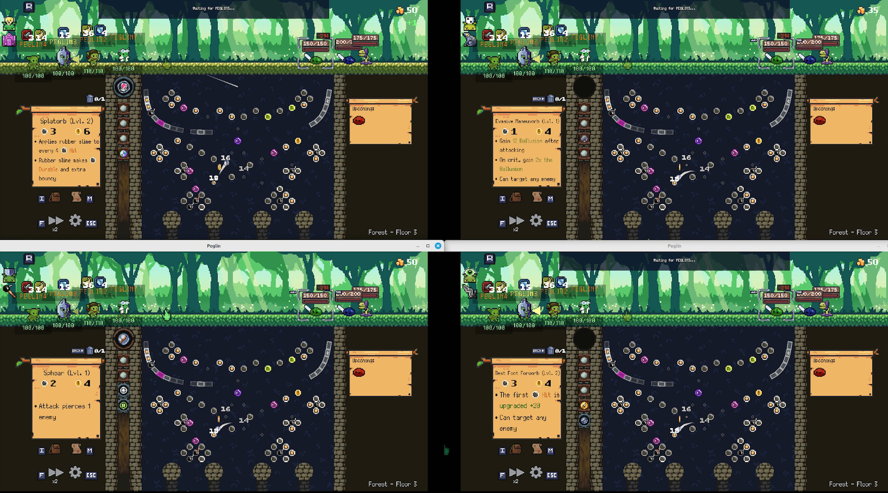
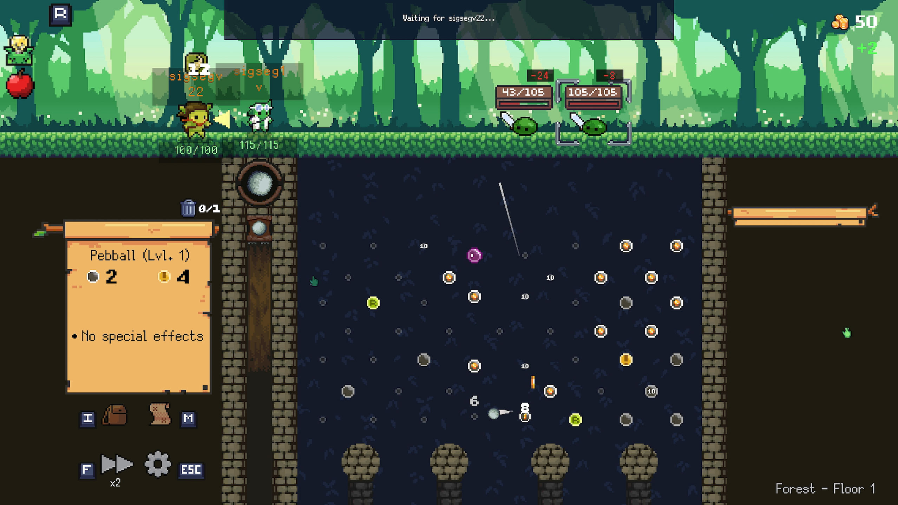

# Multipeglin

A cooperative multiplayer mod for [Peglin](https://store.steampowered.com/app/1296610/Peglin/).

Built with BepInEx 5 + HarmonyX. Cross-platform: Windows (native) and Linux (Proton/Wine).
All scripts use PowerShell (pwsh) for portability.

Here's 4 players playing the same match together so you can see what it looks like:


Here's just one of the players in a two player match:


## Quick Start

If you just want to play the mod, you are at the wrong spot. Go to Thunderstore and search for "[Multipeglin](https://thunderstore.io/c/peglin/p/sigseg1v/Multipeglin/)" and install via a supported app there. Otherwise, if you want to do development on the mod, continue to the below sections.

## Quick Start (dev)

```bash
just dev       # build + install BepInEx + deploy plugin + launch game + tail logs
```

That's it. On first run it downloads BepInEx automatically.

## All Commands

```bash
just build      # compile (debug)
just publish    # compile (release) + copy DLLs to build/
just package    # compile (release) + create Thunderstore package zip in dist/
just setup      # download + install BepInEx into release/ (auto-run by dev/deploy)
just deploy     # build + deploy plugin into release/BepInEx/plugins/
just dev        # build + deploy + launch game + tail logs
just dev-multi  # build + deploy + launch two game instances (host + client)
just dev-network-player  # build + deploy + launch one instance under Steam's Spacewar AppID (480) for real cross-machine Steam networking tests
just log        # tail the dev log file
just clean      # remove build artifacts
just uninstall  # remove BepInEx + reset Proton prefixes (full reset)
```

## Prerequisites

- [.NET SDK](https://dotnet.microsoft.com/) 8+
- [just](https://github.com/casey/just) command runner
- [PowerShell](https://github.com/PowerShell/PowerShell) (pwsh) - cross-platform scripting

## Project Structure

```
src/
  Multipeglin.Core/        Core plugin: Harmony bootstrap
  Multipeglin/             Multiplayer mod
thunderstore/              Thunderstore packaging (manifest, icon, README)
release/                   Game files (do not modify directly)
```

## Development Workflow

1. Build, deploy, and launch with live logs:
   ```bash
   just dev
   ```

2. Launch the game, click **Multiplayer** on the main menu.
   - **Host**: Click Host Game. Share the displayed IP:PORT code.
   - **Join**: Click Join Game. Enter the host's address and click Connect.

### Testing Steam networking across two machines

`just dev-multi` starts two instances on one machine, but both skip Steam init so they can't exercise the Steam transport. To test real Steam lobbies / friend joins / overlay invites on two separate machines, use:

```bash
just dev-network-player
```

Run it on **both** machines. It swaps `release/steam_appid.txt` to Valve's free **Spacewar** AppID (`480`) for the duration of the launch, so Steam lets any account host and join lobbies without owning Peglin on that account. The recipe restores the original AppID (`1296610`) on exit, on Ctrl+C, and as a dependency of `just dev` / `just dev-multi` / `just deploy` so a crashed run never leaves Spacewar set.

Both machines must run `dev-network-player` — the friend-list filter only matches players whose current AppID equals the local process's AppID, so a Spacewar host is invisible to a vanilla-Peglin joiner and vice versa.

## Debug environment variables

Playtest/testing knobs read at launch. Set them in the shell before `just dev` / `just dev-multi`. None ship in release builds' behaviour unless the variable is present.

| Variable | Example | Effect |
|----------|---------|--------|
| `MULTIPEGLIN_DEBUG` | `1` | Enables playtest hotkeys and grants the host a debug starting deck. Gate for hotkey/deck helpers only — does **not** gate the `PEGLIN_*` overrides below. |
| `PEGLIN_SEED` | `4228140002` | Forces a specific game seed for deterministic map/RNG generation (set before `GameInit.Start` picks a random one). |
| `MULTIPEGLIN_FORCE_LEVEL` | `3` or `3-2` | Jumps straight to an act: `1`=Forest, `2`=Castle, `3`=Mines, `4`=Core. Optional second number sets `StaticGameData.totalFloorCount`. |
| `MULTIPEGLIN_FORCE_NODE` | `Mines-10@FlickeringRelicMinigame` | **Host-only.** After the act map generates, fast-forwards node traversal so the run is parked on the map ready to enter the requested `Act-Floor`. The optional `@hint` matches a node's MapData name (or a comma-separated branch path for forked maps). When set without `FORCE_LEVEL`, the act prefix selects the map scene automatically. Skipped in Continue mode. |

Example — deterministic two-player launch parked in front of a Mines act-10 peg-minigame node:

```bash
MULTIPEGLIN_DEBUG=1 PEGLIN_SEED=4228140002 MULTIPEGLIN_FORCE_NODE=Mines-10@FlickeringRelicMinigame just dev-multi
```

`MULTIPEGLIN_INSTANCE`, `MULTIPEGLIN_LOGNAME`, `MULTIPEGLIN_PLAYER_NAME`, and `SKIP_STEAM_INIT` are set automatically by the `just` recipes to distinguish the host/client instances — you don't normally set these by hand.

## Multiplayer

Cooperative multiplayer with per-player classes, decks, relics, and turn-based battles.

The host's game events are captured via static delegate subscriptions, serialized as JSON, and sent over LiteNetLib UDP to the multiplayer client, which replays them by invoking the same game delegates locally.

## Architecture

Key design:
- **Event-sourced host-authoritative** networking
- **IServerHandler / IClientHandler** pairs per event type
- **LiteNetLib** UDP transport with ReliableOrdered delivery
- **System.Text.Json** serialization
- **Dependency injection** via lightweight service container
- **Version checking** with handshake protocol on connect

## Troubleshooting

**Game crashes immediately on launch (no window, no logs)**

The Proton/Wine prefix is likely corrupted. Run:
```bash
just uninstall
just dev
```
This removes BepInEx **and** deletes the Proton prefixes at `~/.steam/steam/steamapps/compatdata/1296610/` and `1296611/`. Proton recreates them automatically on the next launch.

Signs of a corrupted prefix: the game crashes with exit code 1 before writing `Player.log`, BepInEx `LogOutput.log` is stale or missing, and `steam-*.log` shows `err:steam:run_process Failed to create process ... : 2`.

**Game works through Steam but not `just dev`**

Same fix — the prefix was set up by Steam (inside its pressure-vessel container) and may not be compatible with a direct `proton run` invocation. Resetting it with `just uninstall` lets Proton rebuild it cleanly.

**`just dev-multi` — first instance crashes, second works**

The first instance uses prefix `1296610` and the second uses `1296611`. If only the first crashes, the `1296610` prefix is corrupted. `just uninstall` resets both.

**BepInEx loads but game crashes shortly after**

Check `release/BepInEx/LogOutput.log` and `Player.log` (in the Proton prefix under `drive_c/users/steamuser/AppData/LocalLow/Red Nexus Games Inc/Peglin/`). Common causes:
- Stale plugin DLLs in `release/BepInEx/plugins/` — run `just clean && just dev`
- BepInEx cache out of sync — delete `release/BepInEx/cache/` and relaunch
